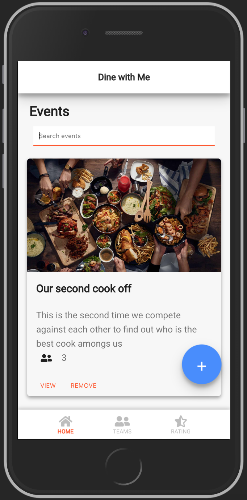

# Dine with Me

A side project I started working on for my firends' game

# Commands
npm install / yarn install - to install dependencies
npm start / yarn start - to run project locally on port:3000